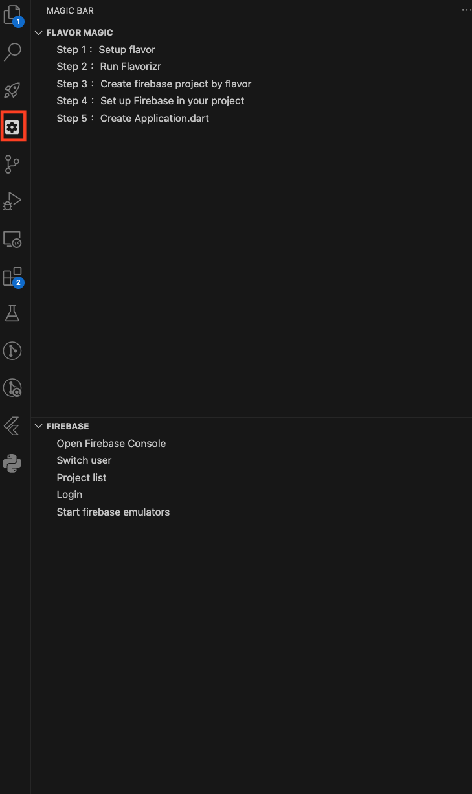

## Fast to setup Flavor and Firebase for new project 
### Dependencies CLI
* [firebase](https://firebase.google.com/docs/cli)
    * setup
    
        ```

        npm install -g firebase-tools
        ```

* [flutter fire](https://firebase.flutter.dev/docs/cli/)
    * setup
        ```
        npm install -g firebase-tools

        dart pub global activate flutterfire_cli
        ```

### How to use

* [Step1] Setup Flavor / Run Flavorizr
    * Dependency
        * [flutter_flavorizr](https://pub.dev/packages/flutter_flavorizr)
    * If create failed use Run Flavorizr to recreate

* [Step2] Create Firebase by Flavor
    * Goal => Use flavor to create firebase project
    * If you already have firebase project, you can skip this step

* [Step3] Pull Firebase
    * Goal => pull firebase project and deploy flavor 
    * Auto setup in android and ios by flavor
    * No need to manually download google-service.json and GoogleService-Info.plist anymore
    * Will create Firebase option at lib/firebase_options
        * sample Flavor [ prod, dev ]
            ```
            lib
            |
            |_ firebase_options
                |
                |_dev_firebase_options.dart
                |_prod_firebase_options.dart
            
            ```
    
* [Step4] Create Application.dart
    * maintain flavor env setup with Application template


# SideBar
